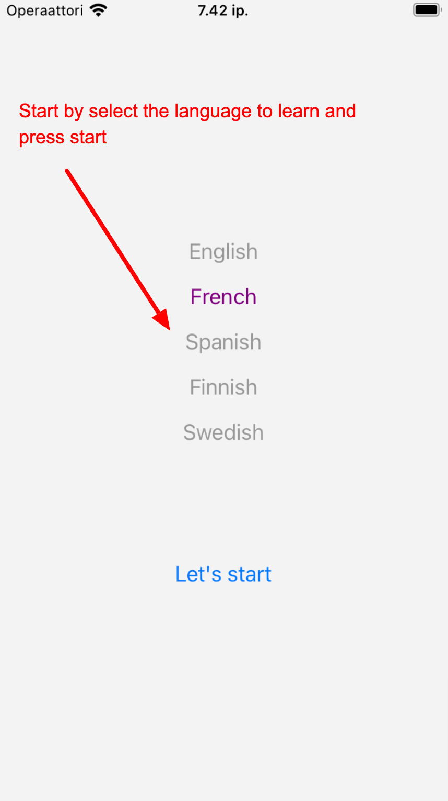

# GptTeacher

GptTeacher is mobile app to study a language by interact conversation between the user and the language teacher chatbot. The app starts by the teacher asking a question in the studying language, then the user can answer the question and the teacher continue asking question, and so on, the conversation just goes on and on forever.

Following is the screenshot of the app (from emulator),




This is a [**React Native**](https://reactnative.dev) project, bootstrapped using [`@react-native-community/cli`](https://github.com/react-native-community/cli) and using the ChatGPT OpenAI API for building the chatbot

# Getting Started

> **Note**: Make sure you have completed the [React Native - Environment Setup](https://reactnative.dev/docs/environment-setup) instructions till "Creating a new application" step, before proceeding.

## Step 0: Install the package

First, go to the root folder, and run

```bash
npm install
```

## Step 1: Start the Metro Server

Then, you will need to start **Metro**, the JavaScript _bundler_ that ships _with_ React Native.

To start Metro, run the following command from the _root_ of your React Native project:

```bash
# using npm
npm start
```

## Step 2: Start your Application

Let Metro Bundler run in its _own_ terminal. Open a _new_ terminal from the _root_ of your React Native project. Run the following command to start your _Android_ or _iOS_ app:

### For Android

```bash
# using npm
npm run android
```

### For iOS

```bash
# using npm
npm run ios
```

If everything is set up _correctly_, you should see your new app running in your _Android Emulator_ or _iOS Simulator_ shortly provided you have set up your emulator/simulator correctly.

This is one way to run your app — you can also run it directly from within Android Studio and Xcode respectively.

## Step 3: Setup the OpenAI API key

Create the file `.env` in the root folder, create the following content and and copy the key over from the OpenAI Dashboard.

**IMPORTANT:** Running the app will incur some costs to the OpenAI service

```
REACT_APP_OPENAI_KEY=<THE OPENAI API KEY>
```
