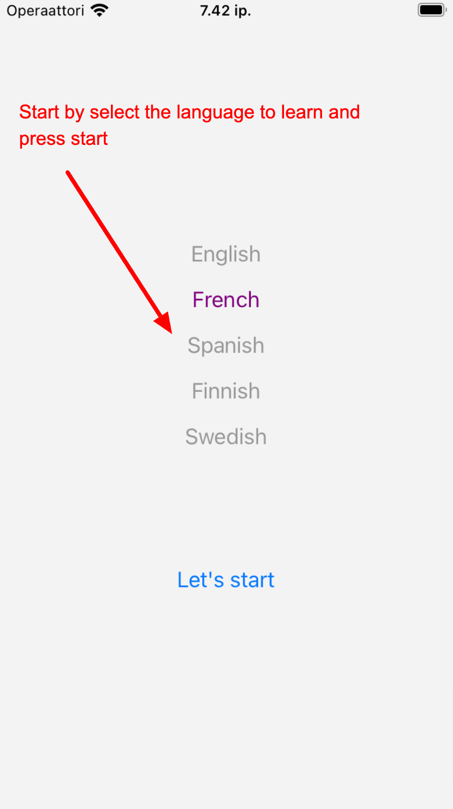
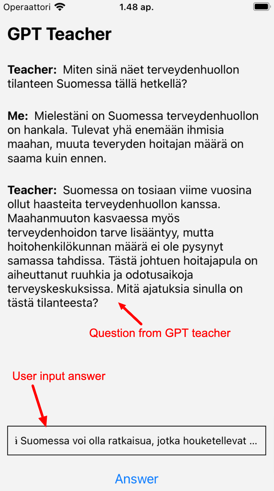
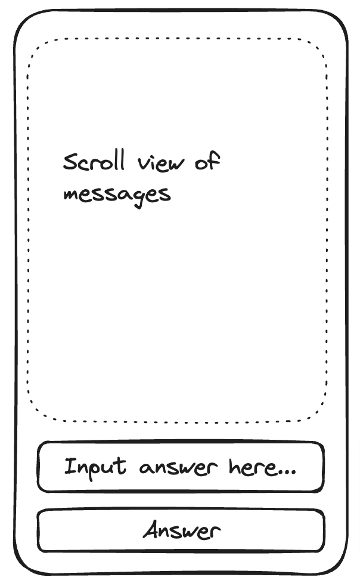

# Develop a chat bot mobile app with ChatGPT and React Native

I believe interaction is a very effective way to improve a person's language skill. However, in daily life, it is not easy to get into such situations. I always dream of a language agent who can patiently talk and listen to me, have a conversation with me in the target language whenever and wherever needed. Thanks again to ChatGPT and OpenAI. My dream nowadays is achievable and I can build it by myself.

In this article, I would like to show how to develop a language teacher agent or chat bot that can ask questions, start a conversation and interact with us in a random topic. This is like an extension of the [previous article](https://reactron.dev/develop-an-app-with-chatgpt/) about how to develop an app with ChatGPT. In addition, I think it is most convenient to have it as a mobile app, so we can use it wherever we go. Thus, I would also like to introduce how to develop mobile apps for Android and iOS using only the React Native, a cross platform React based mobile app development framework (especially also for those who come from the Web background).

## About the App

Our mobile app is called **GptTeacher** and it would be very simple. When started, user can select the language to study and press the "Let's start" button. The agent starts the conversation by asking a question in the stuyding language then the user can answer the question and the language agent continue asking question, and the conversation just goes on and on forever. The implication is that the learner will try to answer it by speaking and then enter the answer to reply.

Following is the screenshot of the app (from emulator),




Please ignore the Finnish part if you don't understand :D. Basically, it is the conversation between the language agent and the users. Throughout the article, for conveniences, it assumed that users selected Finnish to learn.

The app is built using React Native and the OpenAI API. The main focus is to show how to build a chatbot style application similar to ChatGPT chat or sales chat bot. The article assumes that you already knew some basics about OpenAI API and no knowledge about React Native (some React background is recommended but not required). In case you don't have any knowledge about ChatGPT, it is recommended that you check the previous article [here](https://reactron.dev/develop-an-app-with-chatgpt/).

## About React Native

React Native is a React-based framework for building the native mobile apps for Android and iOS, released first version in 2015 from Facebook. React has been well-known in the Web community for building the modern apps, now we can use the same React for mobile development (with just some slight differences from Web). Who come from the React background will almost find it as home when doing React Native.

## Quick recaps from OpenAI Api

In this app, we will use the OpenAI REST API, instead of the SDK for JS. The reason is the current support for SDK is not so stable in React Native. The implementation for using API directly is also straightforward. Basically, the basic idea is still the same, the app interacts with ChatGPT by sending the **prompts** to the OpenAI REST API, so sending prompts is still the essential part in this app.

**NOTE:** All the requests require to have the OpenAI API KEY embedded into the headers. The API key can be obtained from the [https://platform.openai.com/api-keys](https://platform.openai.com/api-keys)

**role:** There are typically 3 roles: _user_, _assistant_ and _system_. In the context of chat bot,

- Role `user` is the end-user like us.
- Role `assistant` is the agent to interact with us (this case the teacher)
- Role `system`: it is the developer giving instructions for the chat bot and the conversation topic.

**temperature:** A parameter used in the API query used to indicate the randomness of the prompt (value is from zero to 1). Zero means it is least random and we can expect the same result for the same input and 1 means it is very random. In this app, pretty much we will use value 1 for all requests since we don't want the conversation to be the same every time.

## How to create the GPT Chat Bot

Before getting start to the app, let's begin with the theory part on how to build a chatbot using ChatGPT. As mentioned, the fundamental mean to interact with ChatGPT is by using the prompts. In the context of a chatbot, it is a bit different with the normal prompts. Instead of a single independent prompt, the chatbot needs to know

- The context of the conversation (a series of messages in timely order)
- The general instruction for the chat bot agent

Therefore, instead of 1 single prompt, we need to send multiple prompts, also in the same timely order to ChatGPT and the first prompt is to instruct how the chat bot behaves and what is the information it needs. For example, the chatbot can be the mobile phone's sales agent, where it will answer customers about what phone models are available and what are the prices?

In this app, we will instruct the bot to be a Finnish language teacher, who will do conversation with students to practise the language. So our first prompt could be

```json
{
    "role": "system",
    "content": "You are a Finnish language teacher. Given the following topics (separated by comma):
Healthcare, Family, Environment, Job, News, Media, Housing.

Pick randomly one from the topics above and start a conversation (in Finnish) with the students."
}
```

The second prompt we need to make is to ask the agent to start the conversation, it can be

```json
{
  "role": "user",
  "content": "Let's start by asking me a question (in Finnish) in a random topic described above"
}
```

By sending these 2 prompts, ChatGPT should return the response from the assistant (in this case the teacher). As a result, the returned message or the question is in Finnish, but here it is in English and just an example to demonstrate the idea.

```json
{
  "role": "assistant",
  "content": "Assistant: How is your family? Do you have any sisters?"
}
```

Now is our turn to reply to the question, suppose our answer is **"My family is fine. Thanks. I have 2 sisters."** We need to send the 2 previous prompts and this prompt to ChatGPT (under the `messages` parameter). Here is an example of whole POST data sent to the API

```js
{
    model: "gpt-3.5-turbo",
    temperature: 1, // we want the result to be fully random
    messages: [
        {
            role: 'system',
            content: '<the instruction above>',
        },
        {
            role: "user",
            content: "Let's start by ..."
}
        {
            role: 'assistant',
            content: "Assistant: How is your family? Do you have any sisters?"
        },
        {
            role: 'user',
            content: 'My family is fine. Thanks. I have 2 sisters.',
        },
    ],
}
```

If successful, the API will return the next question from the assistant. And thus, we continue to get the user input and repeat the same action to append it to all the previous prompts and send them to the API.

This is how we build the chat bot with ChatGPT. There are more we can configure or instruct the bot agent to be. As you can see, in this case, we provided the list and instructed the agent to pick it up randomly. We can add more topics into it if needed or ask the teacher to increase the difficulty level every 10 min to challenge ourselves.
The core of the app is more in how we configure and set up the prompts to instruct the bots to operate the way we want.

## Get Started to the App

Now get started to the app, first we need to setup the environment and create a sample React Native app. From here https://reactnative.dev/docs/environment-setup it has more info on how to prepare the environment setup. **Note that** both Windows PC and MacOS can use React Native, but to test and deploy for iOS platform, MacOS is required.

After the setup environment is done, first we will start by creating a sample app, the following command will create the whole sample app and ready to run. The command should run to the end successfully.

```
$ npx react-native init GptTeacher
```

If without error, then let's start to run the app

```
$ npm start

# OR run it directly to the target platform
$ npm run ios
$ npm run android
```

We should see the emulator (iOS or Android) shown up and open into the sample app we just created.

Now open the folder and the file `App.tsx` in any editor or IDE, modify a few texts randomly to see the app reloaded and changes.

We're done for creating a sample app. How quickly to start and awesome for mobile app development!

### 1. Prepare the API key

Next, we need to obtain or create the new API key from the OpenAI developer dashboard https://platform.openai.com/api-keys.

Then create a new file `.env` in the root folder,

```
OPENAI_API_KEY=<API_KEY>
```

For managing the application config, we use the package `react-native-config` (https://www.npmjs.com/package/react-native-config?activeTab=readme).

Open the terminal and install the package

```
$ npm install react-native-config
```

In the app, the config can be accessed by

```js
import Config from 'react-native-config';

Config.OPENAI_API_KEY; // the api key
```

### 2. Make the OpenAI prompt request

For the HTTP requests, we use the package `axios` to make requests to the OpenAI REST API. Here is the helper function where we embed the API KEY, send the prompts and get the response from the API.

```javascript
import Config from 'react-native-config';
import axios from 'axios';

const OPENAI_URL = 'https://api.openai.com/v1/chat/completions';

type GptPrompt = {
  role: string,
  content: string,
};

/** Send prompts to OpenAI API
 *
 * @return the response message (with role and content) or null
 */
const sendPrompts = async (messages: GptPrompt[]) => {
  const response = await axios.post(
    OPENAI_URL,
    {
      model: 'gpt-3.5-turbo',
      temperature: 1,
      messages,
    },
    {
      headers: {
        'Content-Type': 'application/json',
        Authorization: `Bearer ${Config.OPENAI_API_KEY}`,
      },
    },
  );

  return response.data.choices?.[0]?.message;
};
```

### React Native (RN) components

Going further to the React Native, built on top of the React concepts, React Native also operates around the UI components and the flow of component states and properties updates, it also updates the UI automatically. The whole React thing is also applied here. However, there are 2 main differences with the React Web on the surface,

- Instead of HTML components, RN provides the whole new and core set of native UI components. For example, `<div>` becomes `<View />` and `<p>` or `<span>` become `<Text />`. It is called **native** since these components will look like a native component in the target platform.

- Instead of CSS with cascading, RN provides the `styles` property for each component. These styles are not cascaded, except with the `<Text />` component. And the main component `<View />` uses the flex box layout by default (similar to `display: flex` in Web)

There are slightly more differences on the surface and under the hood between React and React Native, but with the React background on the Web, one can easily get familiar and start to develop the apps quickly.

Now let's start with the UI. Note that the article's aim is to give the introduction and a glance into the core components in RN and will not go deeper into those.

Our app basically will need 3 basic components,

- A text input component to let users input the answer (component `<TextInput />` in RN)
- A button component that user presses to send the answer (component `<Button />` in RN)
- A scrollable view to display the messages. It is scrollable since there might be a lot of messages and the view should be able to scroll to the bottom (component `<ScrollView />` in RN)

Here is the simplified code version for placing out these components into our UI.

```js
<View style={styles.container}>
    <ScrollView style={styles.main}}>
        {messages.map((message, index) => (
            <View style={styles.messageItem} key={index}>
                <Text style={styles.message}>
                    <Text style={styles.prefix}>
                    {message.role === 'user' ? 'Me: ' : 'Teacher: '}
                    </Text>

                    {message.content.replace(/Assistant: /gi, '')}
                </Text>
            </View>
        ))}
    </ScrollView>

    <TextInput
        style={styles.input}
        onChangeText={onChangeText}
        placeholder="Reply here..."
        value={text}
    />

    <Button title="Answer" color="#f194ff" onPress={handlePress} />
</View>
```

The code above defines the layout, in which, the input text and the button to the bottom and the rest of the space is for the scroll view to contain the messages and able to scroll.



Note that all the components have the optional `style` prop instead of `className` as in Web to define the styles for the component (all other properties are defined by the component itself). Following is how the styles are created and defined.

```js
const styles = StyleSheet.create({
  container: {
    height: '100%',
    justifyContent: 'center',
  },
  main: {
    flex: 1,
  },
  messageItem: {
    padding: 12,
    flexDirection: 'column',
  },
  prefix: {
    fontWeight: 'bold',
    fontSize: 16,
  },
  message: {
    fontSize: 16,
  },
  input: {
    height: 40,
    margin: 12,
    borderWidth: 1,
    padding: 10,
  },
});
```

The style's attribute and value are pretty much the same in Web, except that there is no `px` or `em` unit. Styles in RN are unitless and represent the density-independent pixel (or `dp` unit). As on mobile devices, there are various screen sizes and pixel densities, it is not so helpful to define exact pixels by using `px` or `em`. One could display nicely on a low density phone but so small or broken on high end, high density phones.

In this layout, for the scrollable view, we set `flex: 1` to expand the whole space as much as possible like in flex box. This is just to show how similiar between the React Web and React Native.

### Implementation

The implementation is also quite straightforward. We maintain in the app's state the list of prompts, each prompt is an object with 2 keys, `role` and `content`. Initially, the prompt contains 2 items, the first item is for the system to set the instruction and the second one is for the user to ask to start the conversation.

```js
const [prompts, setPrompts] = useState<GptPrompt[]>([
    { role: 'system', content: 'You are a language teacher... ' },
    { role: 'user', content: 'Let start by asking me a question...' },
]);
```

When the user answers the question and presses **Answer** button, the new prompt is added to the list and sent to the API. When the response is returned, the new message or prompt is again added to the list and React will automatically take care of rendering them in the UI.

```js
// ahe callback function handles the button press
// add user prompt to the list
// after api call add it again to the list
const handlePress = async () => {
  const userPrompt = {
    role: 'user',
    content: text, // 'text' is user input
  };

  const agentPrompt = await sendPrompts([...prompts, userPrompt]);

  if (agentPrompt) {
    const {content, role} = prompt;

    setPrompts([...prompts, userPrompt, agentPrompt]);
  }
};
```

We now have all the connecting pieces to complete the app. In the future, the app can be easily integrated with the features that the language agent can speak (text-to-voice) and the user replies in voice (voice-to-text), like the actual real conversation, by using the services from the cloud providers such as AWS, Azure or Google cloud.

## Conclusion

To recap, the article has presented how to build a chat bot with ChatGPT. Once again, it is shown how easy nowadays to build a smart and interesting app with just some simple steps. The article also took a chance to introduce React Native, a React-based framework that helps building the mobile apps for cross platforms. I believe it is a great solution to reduce the cost of developing apps for each separate platform. In addition, the RN code, which is based on React, which is well-known for quick learning curve, is simple and intuitive. Even if you're totally new to React, the code itself is also self explanatory, making it quick and easy to get right into development. Especially for those, who come from Web background, now can jump into the mobile area directly without much hassles.

Combining both, I believe there will be plenty of exciting spaces and applications that can utilize both technologies. The creativity is again limitless! Thank you.

### Source code

You can find the source code from the zip file for the complete working app.

### Publishing the app

After the app is built and tested on the emulator, it is only a few steps to deploy it to the physical devices.

For example on Android, activate the Debug mode in the device, like setup in here https://reactnative.dev/docs/running-on-device?platform=android

```shell
$ adb devices       # to list the devices
$ npm run android   # to deploy the app to device
```
